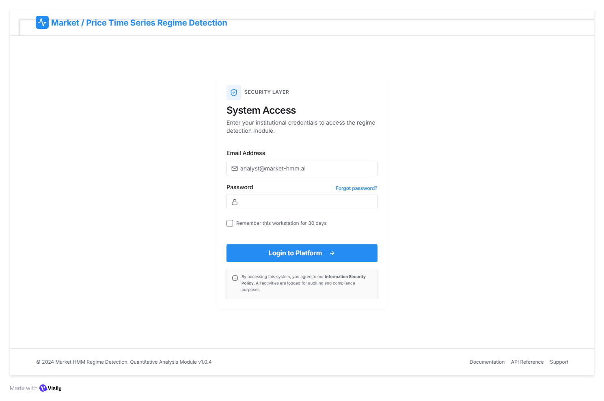
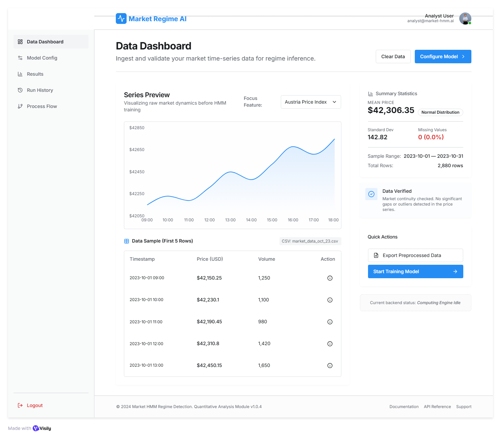
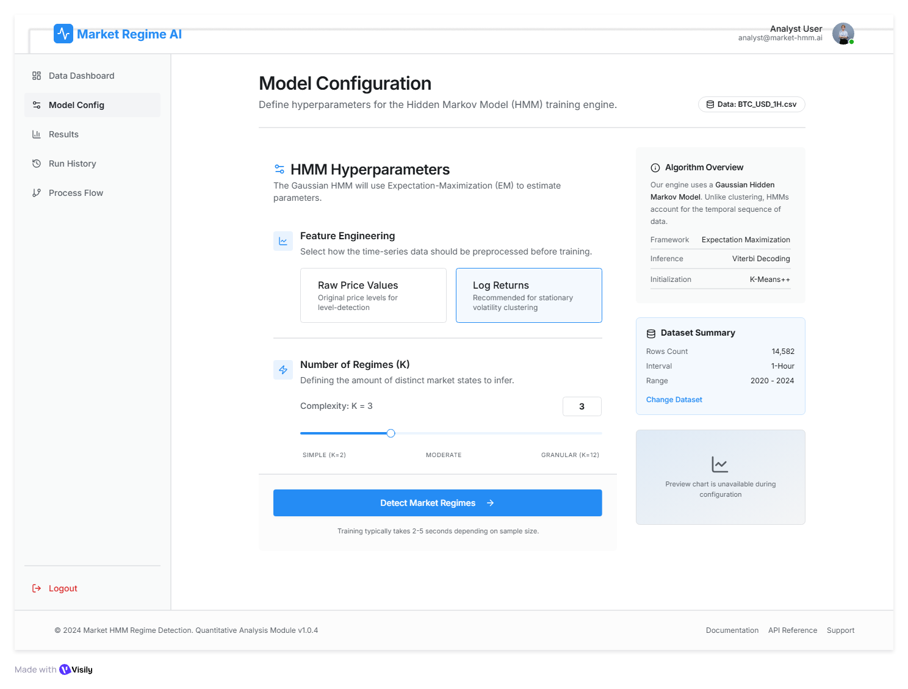
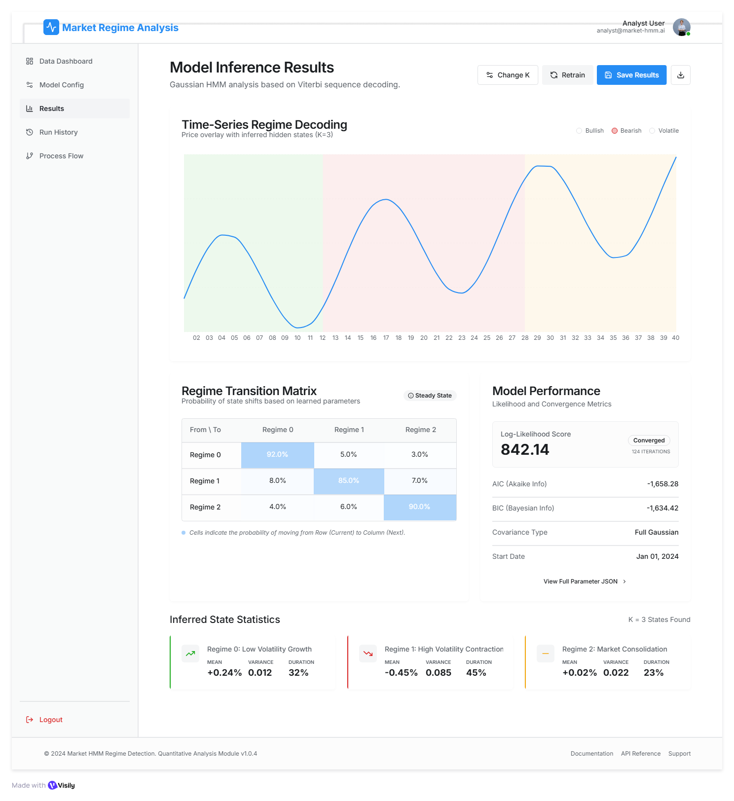
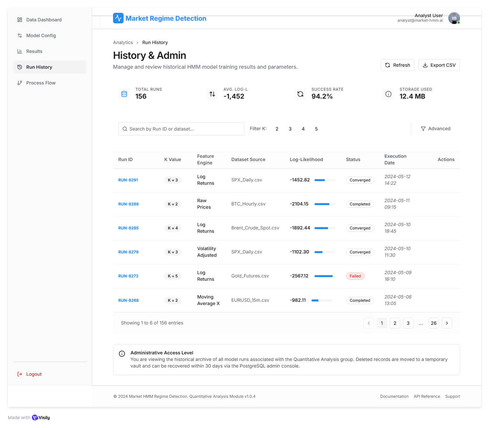

## Wireframes – ML App Layer

These wireframes demonstrate the complete workflow of the 
Hidden Markov Model-based Regime Detection System:

Upload → Preprocessing → HMM Training (EM) → Viterbi Inference → Visualization

---

### 🔐 Login Screen

---

### 📊 Dashboard (Upload + Preview)

---

### ⚙️ Model Input Screen

---

### 📈 Prediction / Output Screen

---

### 🗂 History / Admin Screen

---

### 🔄 User Flow Diagram
.png)
