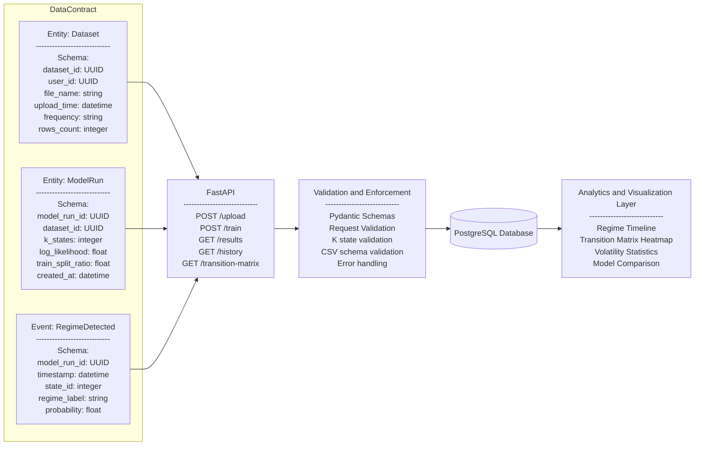

```mermaid

flowchart LR

%% =========================
%% DATA CONTRACT
%% =========================

subgraph DataContract

    DatasetEntity["Entity: Dataset
    ----------------------------
    Schema:
    dataset_id: UUID
    user_id: UUID
    file_name: string
    upload_time: datetime
    frequency: string
    rows_count: integer
    "]

    ModelRunEntity["Entity: ModelRun
    ----------------------------
    Schema:
    model_run_id: UUID
    dataset_id: UUID
    k_states: integer
    log_likelihood: float
    train_split_ratio: float
    created_at: datetime
    "]

    RegimeEvent["Event: RegimeDetected
    ----------------------------
    Schema:
    model_run_id: UUID
    timestamp: datetime
    state_id: integer
    regime_label: string
    probability: float
    "]

end

%% =========================
%% API LAYER
%% =========================

API["FastAPI
----------------------------
POST /upload
POST /train
GET /results
GET /history
GET /transition-matrix
"]

DatasetEntity --> API
ModelRunEntity --> API
RegimeEvent --> API

%% =========================
%% VALIDATION LAYER
%% =========================

Validation["Validation and Enforcement
----------------------------
Pydantic Schemas
Request Validation
K state validation
CSV schema validation
Error handling
"]

API --> Validation

%% =========================
%% STORAGE
%% =========================

Database[(PostgreSQL Database)]

Validation --> Database

%% =========================
%% ANALYTICS PIPELINE
%% =========================

Analytics["Analytics and Visualization Layer
----------------------------
Regime Timeline
Transition Matrix Heatmap
Volatility Statistics
Model Comparison
"]

Database --> Analytics

```