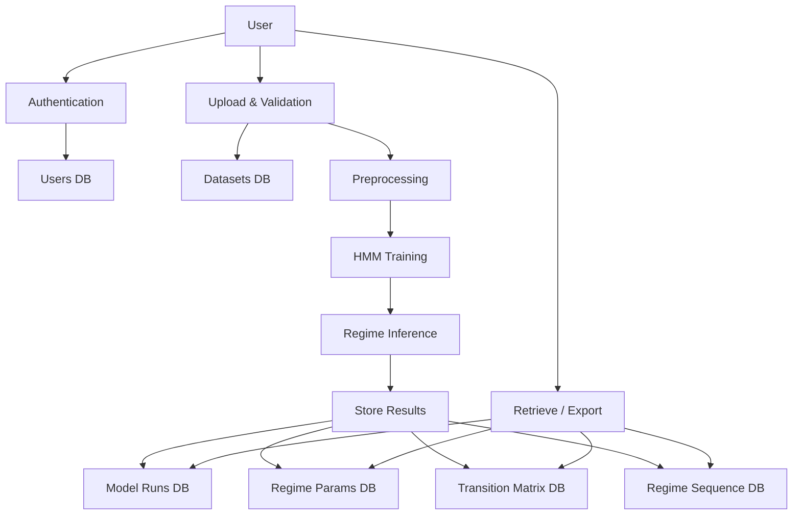

```mermaid

flowchart TD

    User[User]

    %% Authentication Branch
    User --> Authentication[Authentication]
    Authentication --> UsersDB[Users DB]

    %% Upload & Processing Pipeline
    User --> UploadValidation[Upload & Validation]
    UploadValidation --> DatasetsDB[Datasets DB]
    UploadValidation --> Preprocessing[Preprocessing]
    Preprocessing --> HMMTraining[HMM Training]
    HMMTraining --> RegimeInference[Regime Inference]
    RegimeInference --> StoreResults[Store Results]

    %% Result Storage
    StoreResults --> ModelRunsDB[Model Runs DB]
    StoreResults --> RegimeParamsDB[Regime Params DB]
    StoreResults --> TransitionMatrixDB[Transition Matrix DB]
    StoreResults --> RegimeSequenceDB[Regime Sequence DB]

    %% Retrieve / Export
    User --> RetrieveExport[Retrieve / Export]

    RetrieveExport --> ModelRunsDB
    RetrieveExport --> RegimeParamsDB
    RetrieveExport --> TransitionMatrixDB
    RetrieveExport --> RegimeSequenceDB

```