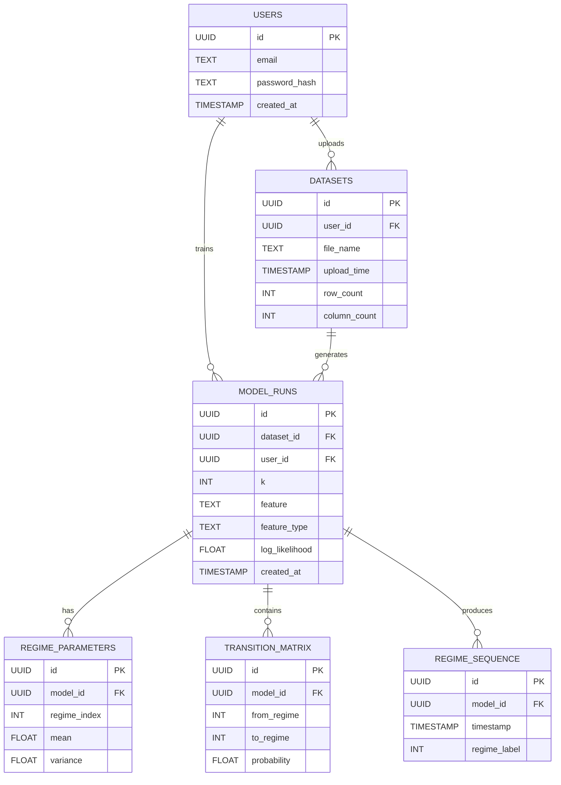

```mermaid

erDiagram

USERS ||--o{ DATASETS : uploads
USERS ||--o{ MODEL_RUNS : trains
DATASETS ||--o{ MODEL_RUNS : generates

MODEL_RUNS ||--o{ REGIME_PARAMETERS : has
MODEL_RUNS ||--o{ TRANSITION_MATRIX : contains
MODEL_RUNS ||--o{ REGIME_SEQUENCE : produces

USERS {
UUID id PK
TEXT email
TEXT password_hash
TIMESTAMP created_at
}

DATASETS {
UUID id PK
UUID user_id FK
TEXT file_name
TIMESTAMP upload_time
INT row_count
INT column_count
}

MODEL_RUNS {
UUID id PK
UUID dataset_id FK
UUID user_id FK
INT k
TEXT feature
TEXT feature_type
FLOAT log_likelihood
TIMESTAMP created_at
}

REGIME_PARAMETERS {
UUID id PK
UUID model_id FK
INT regime_index
FLOAT mean
FLOAT variance
}

TRANSITION_MATRIX {
UUID id PK
UUID model_id FK
INT from_regime
INT to_regime
FLOAT probability
}

REGIME_SEQUENCE {
UUID id PK
UUID model_id FK
TIMESTAMP timestamp
INT regime_label
}

```