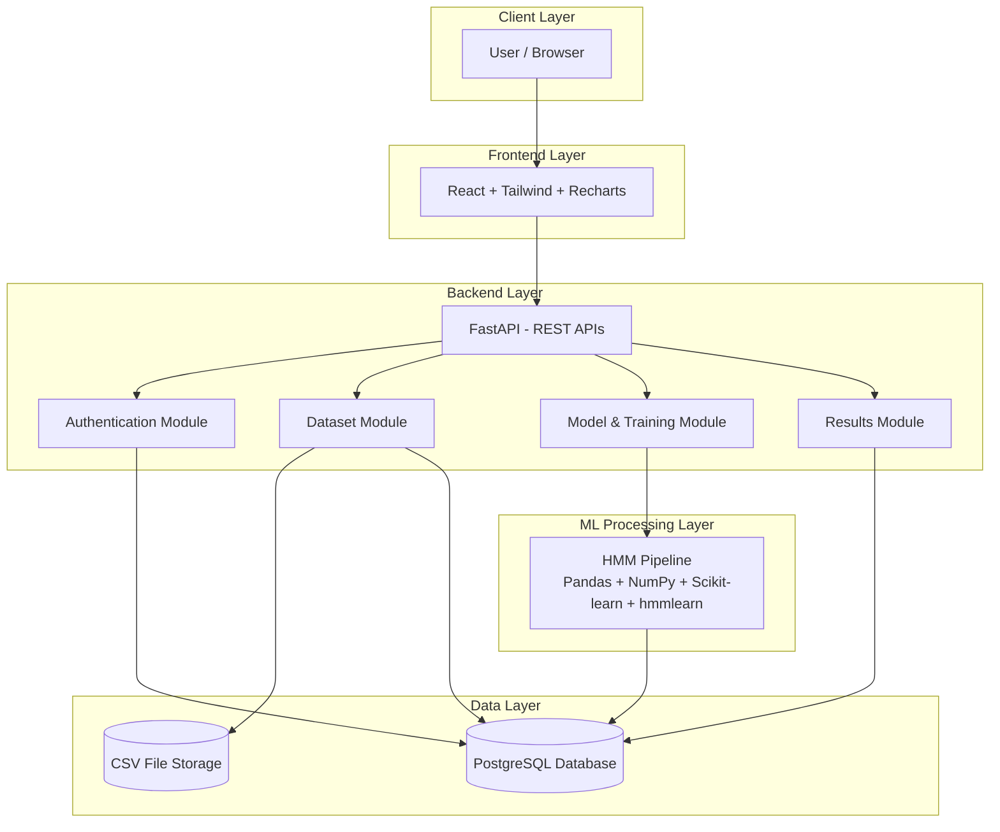

```mermaid

flowchart TB

subgraph Client Layer
User[User / Browser]
end

subgraph Frontend Layer
Frontend[React + Tailwind + Recharts]
end

subgraph Backend Layer
APIGateway[FastAPI - REST APIs]
AuthService[Authentication Module]
DatasetService[Dataset Module]
ModelService[Model & Training Module]
ResultService[Results Module]
end

subgraph ML Processing Layer
MLService[HMM Pipeline\nPandas + NumPy + Scikit-learn + hmmlearn]
end

subgraph Data Layer
DB[(PostgreSQL Database)]
Storage[(CSV File Storage)]
end

User --> Frontend
Frontend --> APIGateway

APIGateway --> AuthService
APIGateway --> DatasetService
APIGateway --> ModelService
APIGateway --> ResultService

AuthService --> DB

DatasetService --> Storage
DatasetService --> DB

ModelService --> MLService
MLService --> DB

ResultService --> DB

```