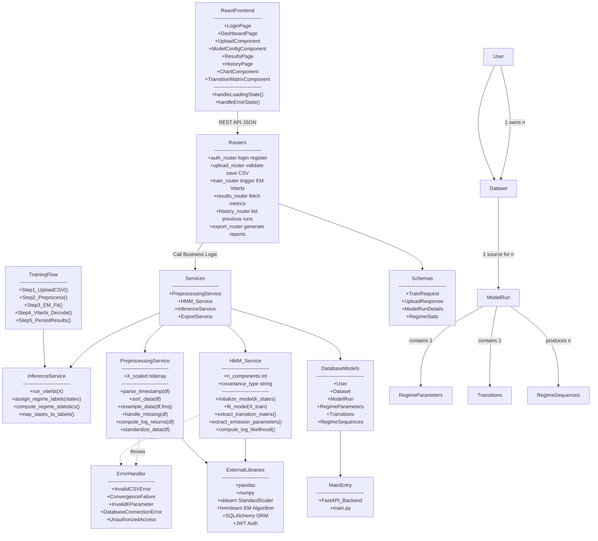

```mermaid

flowchart TB

%% =========================
%% TOP LAYER
%% =========================

ReactFrontend["ReactFrontend
----------------------------
+LoginPage
+DashboardPage
+UploadComponent
+ModelConfigComponent
+ResultsPage
+HistoryPage
+ChartComponent
+TransitionMatrixComponent
----------------------------
+handleLoadingState()
+handleErrorState()
"]

InferenceService["InferenceService
----------------------------
+run_viterbi(X)
+assign_regime_labels(states)
+compute_regime_statistics()
+map_states_to_labels()
"]

TrainingFlow["TrainingFlow
----------------------------
+Step1_UploadCSV()
+Step2_Preprocess()
+Step3_EM_Fit()
+Step4_Viterbi_Decode()
+Step5_PersistResults()
"]

User["User"]

%% Connections (Top)

ReactFrontend -->|REST API JSON| Routers
TrainingFlow --> InferenceService

User --> Dataset

%% =========================
%% ROUTERS
%% =========================

Routers["Routers
----------------------------
+auth_router login register
+upload_router validate save CSV
+train_router trigger EM Viterbi
+results_router fetch metrics
+history_router list previous runs
+export_router generate reports
"]

Routers -->|Call Business Logic| Services
Routers --> Schemas

%% =========================
%% SERVICES LAYER
%% =========================

Services["Services
----------------------------
+PreprocessingService
+HMM_Service
+InferenceService
+ExportService
"]

PreprocessingService["PreprocessingService
----------------------------
+X_scaled ndarray
----------------------------
+parse_timestamp(df)
+sort_data(df)
+resample_data(df,freq)
+handle_missing(df)
+compute_log_returns(df)
+standardize_data(df)
"]

HMMService["HMM_Service
----------------------------
+n_components int
+covariance_type string
----------------------------
+initialize_model(k_states)
+fit_model(X_train)
+extract_transition_matrix()
+extract_emission_parameters()
+compute_log_likelihood()
"]

Services --> PreprocessingService
Services --> HMMService
Services --> InferenceService

%% =========================
%% SCHEMAS + ERROR
%% =========================

Schemas["Schemas
----------------------------
+TrainRequest
+UploadResponse
+ModelRunDetails
+RegimeStats
"]

ErrorHandler["ErrorHandler
----------------------------
+InvalidCSVError
+ConvergenceFailure
+InvalidKParameter
+DatabaseConnectionError
+UnauthorizedAccess
"]

HMMService -. throws .-> ErrorHandler
PreprocessingService -. throws .-> ErrorHandler

%% =========================
%% EXTERNAL LIBRARIES
%% =========================

ExternalLibraries["ExternalLibraries
----------------------------
+pandas
+numpy
+sklearn StandardScaler
+hmmlearn EM Algorithm
+SQLAlchemy ORM
+JWT Auth
"]

PreprocessingService --> ExternalLibraries
HMMService --> ExternalLibraries

%% =========================
%% DATABASE MODELS
%% =========================

DatabaseModels["DatabaseModels
----------------------------
+User
+Dataset
+ModelRun
+RegimeParameters
+Transitions
+RegimeSequences
"]

MainEntry["MainEntry
----------------------------
+FastAPI_Backend
+main.py
"]

Services --> DatabaseModels
DatabaseModels --> MainEntry

%% =========================
%% ENTITY RELATION SIDE
%% =========================

Dataset["Dataset"]
ModelRun["ModelRun"]
RegimeParameters["RegimeParameters"]
Transitions["Transitions"]
RegimeSequences["RegimeSequences"]

User -->|1 owns n| Dataset
Dataset -->|1 source for n| ModelRun
ModelRun -->|contains 1| RegimeParameters
ModelRun -->|contains 1| Transitions
ModelRun -->|produces n| RegimeSequences

```
